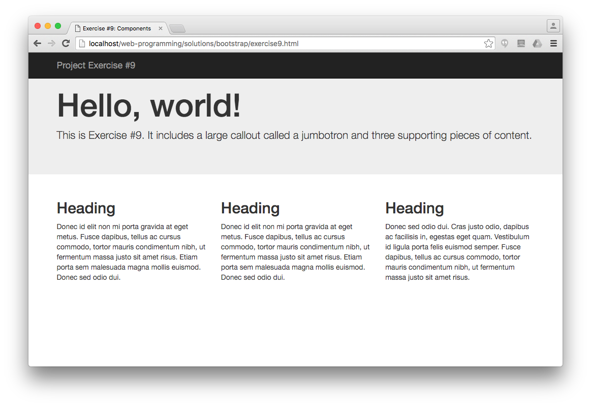
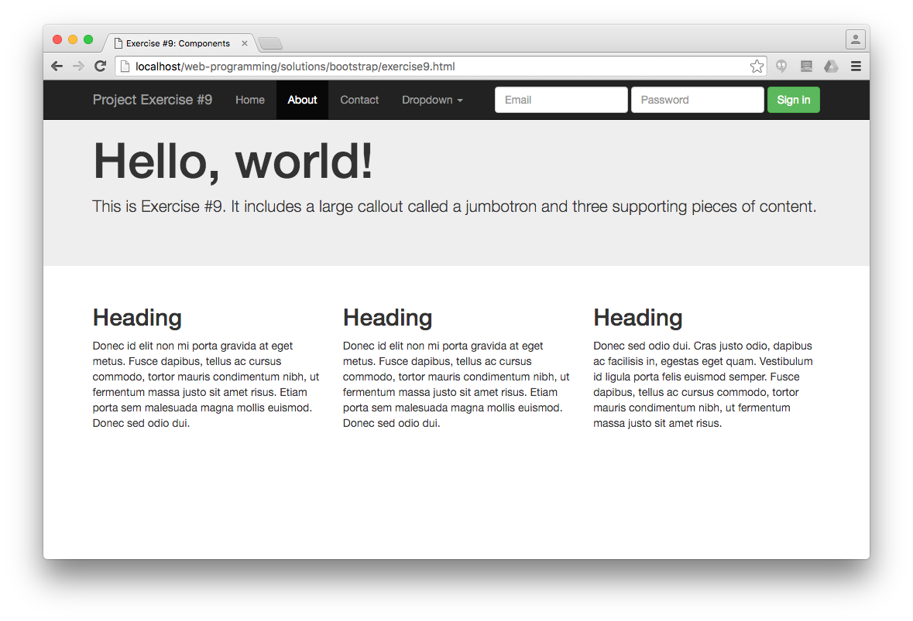
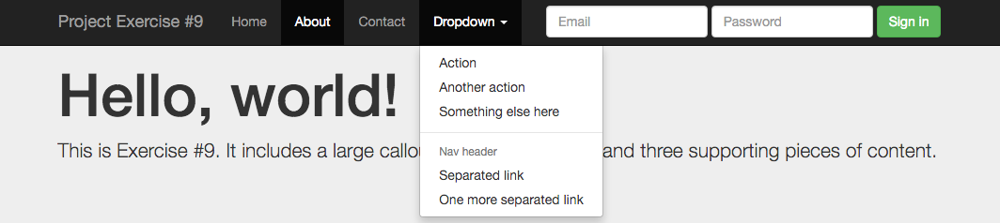
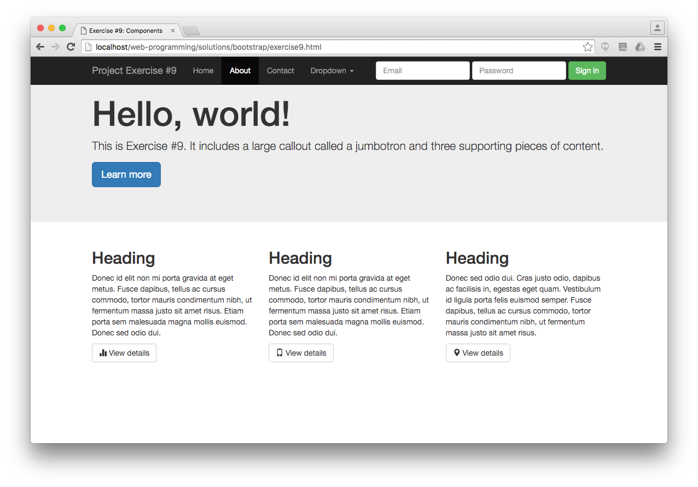
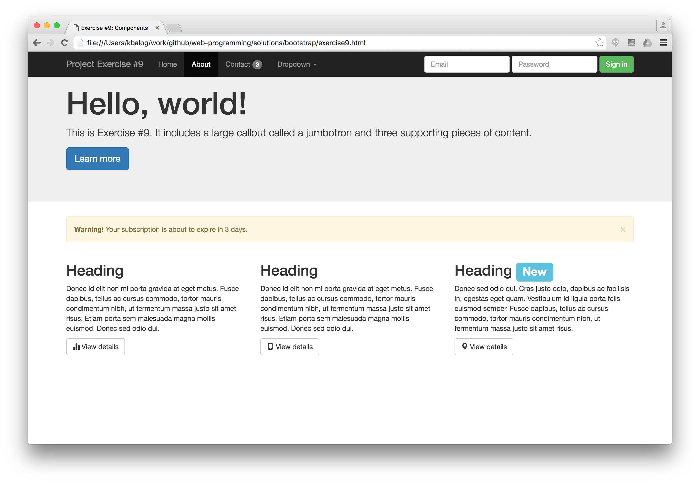

# Patstāvīgaids darbs Bootstrap

Izmēģiniet dažādus Bootstrap komponentes darbībā, veidojot lapu soli pa solim. Šim vingrinājumam nav sākuma faila, viss ir jāraksta no nulles.

1) Pievienojiet navigācijas joslu, pilna platuma jumbotron un 3 kolonnas ar dotu saturu.

2) Paplašiniet navigācijas joslu ar sekojošām iespējām:
- navbar vienmēr jāfiksējas ekrāna augšpusē.
- pievienot trīs izvēlnes elementus plus nolaižamo izvēlni pa kreisi. Atzīmējiet otro izvēlnes elementu kā aktīvu.
- pa labi pievienot pierakstīšanās formu ar e-pasta un paroļu laukiem.

3) Pievienojiet jumbotron primāro pogu “Learn more” un pogas “View details” vidējā lielumā ar atšķirīgiem glyphicons zem teksta blokiem katrā kolonnā.

4) Zem jumbotron pievienojiet noraidāmu brīdinājumu un trešās kolonnas virsrakstam “New” etiķeti. Turklāt navbar sadaļai “Contact” pievienojiet emblēmu ar numuru.

